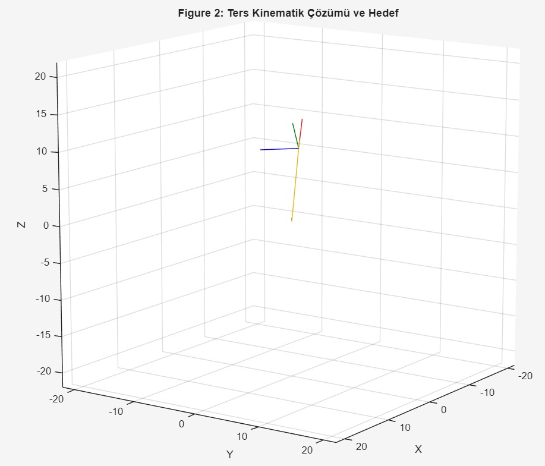

# Kinematic Analysis of a 3-DOF PRR Planar Manipulator

This repository contains the MATLAB scripts for the kinematic modeling and simulation of a PRR (Prismatic-Revolute-Revolute) robot manipulator. This work was conducted as part of the "Modeling and Control of Robots" PhD course.

## 🚀 Features
* **Forward Kinematics:** Analytical and simulation-based calculation of end-effector position.
* **Inverse Kinematics:** Solving joint variables for a target pose using optimization methods.
* **Visualization:** 3D rendering of the robot using MATLAB Robotics System Toolbox (R2025b).

## 🛠️ Requirements
* MATLAB R2025b (or newer)
* Robotics System Toolbox

## 📊 Results

### Forward Kinematics

### Inverse Kinematics

## 👤 Author
**Engin Can GİRGİNEL** PhD Student, Mechatronics Engineering  
Bursa Technical University
